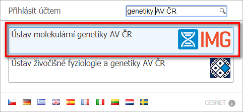
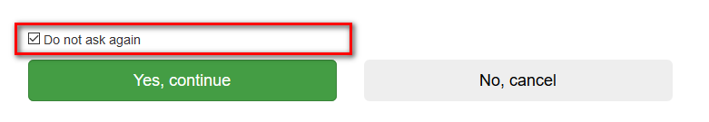
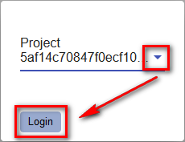
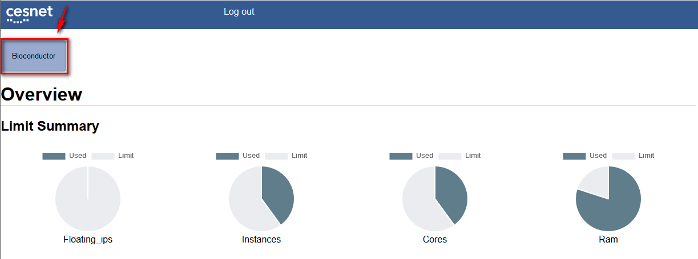
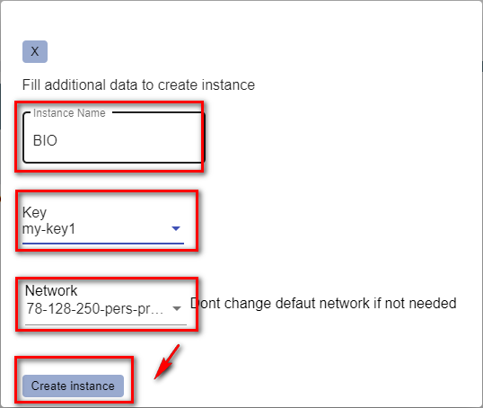
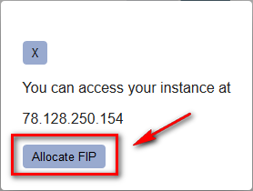

# Launch instance with BIO software using frontend application

* If you do not have a MetaCentrum account, please try to create it according to the documentation at [cloud pages][cloud]
* The teacher should then add all students to the bioconductor group at https://perun.metacentrum.cz. This is necessary to provide access to the folder on NFS, etc. Also, we need to report the added logins to our Openstack colleagues for further action.

## Frontend application

[Frontend][bio-portal] automates the steps required to launch the instance.
The interface for manual startup and necessary settings that the frontend is not yet able to do is [cloud dashboard][cloud-dashboard].

* Launch instance
  * When using the [frontend][bio-portal], log in using EDUID
    * 
  * On the `Consent about releasing personal information` select `Do not ask again` and confirm `Yes, continue`
    * 
  * After logging in using EDUID, a project selection is offered if the user has more than one. If you do not have multiple projects, then you proceed directly to the overview
    * 
  * Start your new instance using button *Bioconductor*
    * 
  * Instances should be launched in a personal project and with the public-cesnet-78-128-250-PERSONAL network, and this can be edited in the selection
    * Insert *Name* of your new virtual machine
    * Select the public key to use ([Key pair section in manual launch guide][launch-in-personal-project])
    * Check if the network 78-128-25-pers-proj is selected, otherwise select it
    * Click the button *Create Instance*
    * 
  * Wait until the machine launch has finished. Confirm Allocate Floating IP
    * 
    * Connect to the instance using your login, id_rsa key registered in Openstack and Floating IP

[bio-portal]: http://bio-portal.metacentrum.cz
[cloud]: https://cloud.muni.cz
[cloud-dashboard]: https://dashboard.cloud.muni.cz
[launch-in-personal-project]: ./launch-in-personal-project.md#key-pair
