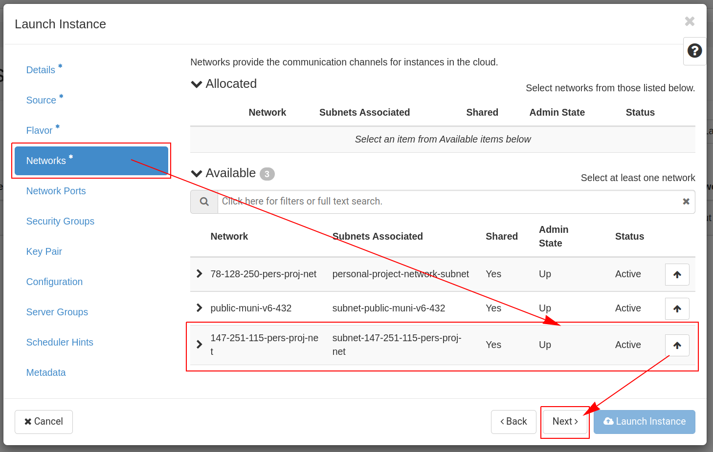
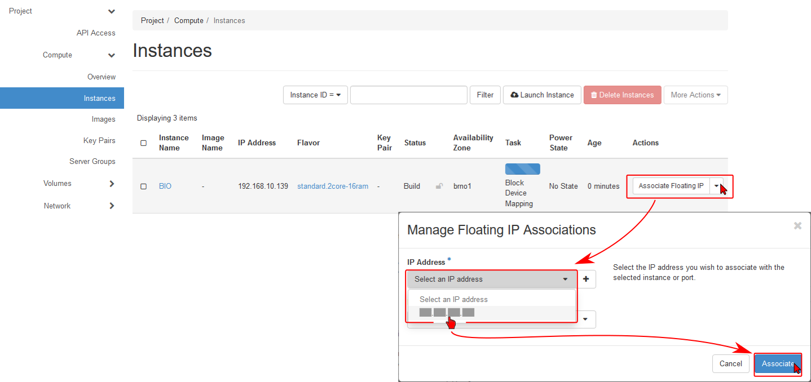

# Launch New Instance in Personal Project 

Using prepared image is a preferred way. Frontend appliacation is prepared to fully cover instance launch steps automatically on background. Proceed with guide below if manual instance launch needed.

* Follow the instructions [Quick Start](https://cloud.gitlab-pages.ics.muni.cz/documentation/quick-start/)
  * Check Router, obtain Floating IP, update Security Group
    * Check if Router contain External Network *public-cesnet-78-128-250-PERSONAL*
      * Open Project -> Network -> Routers
      * If other setting, then use button *Clear Gateway*, confirm *Clear Gateway*
      * Select network *public-cesnet-78-128-250-PERSONAL* and *Submit*
      
    * ### Floating IP
      * Check if Floating IP exists
      * Open Project -> Network -> Floating IPs
      * If *No item to display* then use button *Allocate IP To Project*
      * Select *public-cesnet-78*128*250-PERSONAL* and confirm using button *Allocate IP*
    
    * ### Manage Security Group Rules
      * Open Project -> Network -> Security Groups
      * Check if present rules (SSH, HTTP, HTTPS, Egress IPv4 Any Any 0.0.0.0/0), otherwise add new rule using button *Add Rule*
        * Ingress         IPv4    TCP     22 (SSH)        0.0.0.0/0
        * Ingress         IPv4    TCP     80 (HTTP)       0.0.0.0/0
        * Ingress         IPv4    TCP     443 (HTTPS)     0.0.0.0/0
        * Egress	  IPv4 	  Any     Any             0.0.0.0/0 (select *Rule* *Other Protocol*, select *Direction* *Egress*, insert *-1* as *IP protocol*)
    
* Launch instance
    * Open Project -> Compute -> Instances and use button **Launch Instance**
    
    * Insert Instance Name, Description
    
    * Source:
      * Select Boot source: **Image**
      * Select **Yes** for Delete Volume on Instance delete
      * Use Up Arrow to select image with **bioconductor software**
    
    * Select Flavor *2 CPU* and *16GB RAM*
    
    * Select Network *78-128-250-pers-proj-net* - *personal-project-network-subnet*
    
    * ### Key pair
      * **If public key imported already**, add existing key to the instance and continue using button **Next**
      * **Import Key Pair** if existing SSH key on your local computer, but not listed as available, then import public key using button **Import Key**
        * Insert Key Pair Name
        * Select SSH key for Key Type
        * Load Public Key from a file or copy/paste public key content in the field
        * Add key and continue using button **Next**
      * **Create key Pair** if any public key not available
        * Use button **Create Key Pair**
        * Insert Key Pair Name
        * Select SSH key for Key Type
        * Use button **Create KeyPair**
        * Copy Private Key to Clipboard and save it to the ~/.ssh/id_rsa on your local computer
        * Confirm using button **Done**
        * Now the public key is available down on the page. Use arrow before key name to show public part. Copy this public key to the file ~/.ssh/id_rsa.pub on your local computer
        * Add key and continue using button **Next**
        * Check Access Privileges on .ssh Folder using commands `chmod 700 .ssh/`, `chmod 644 .ssh/id_rsa.pub` and `chmod 600 .ssh/id_rsa`
    
    * In Configuration insert code from [cloud-init-bioconductor-image.sh](./../../install/cloud-init-bioconductor-image.sh) (At Github use button Raw to display raw code) or use **Browse** button to search in clonned repository `git clone https://github.com/bio-platform/bio-class.git`.
    
    
    * In Metada insert variables:
        * *Bioclass_user* containg your login
        * *Bioclass_email* containing your email
        * Proceed with **Launch button**
    
* Wait until instance initialization finished and Associate Floating IP
  * All required settings are executed during instance boot
  * Use button **Associate Floating IP**
  * Select available floating IP and confirm using button **Associate**
    
* Login using your [SSH key as selected in Key pair above and Floating IP](./../../README.md#ssh-access)
  * Set up [NFS and HTTPS](./../../README.md#nfs-and-https)
